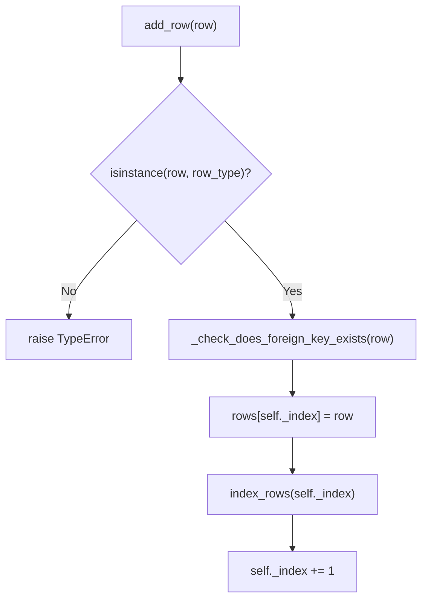
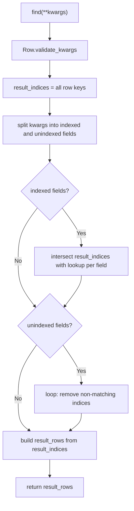

# pyrodb

A lightweight in-memory database built in Python, designed around class-based table and row definitions.

---

## Concepts

- **Field** — defines a column name and its expected type
- **Row** — a base class your data models inherit from; enforces field types on instantiation
- **Table** — holds rows of a given type; supports add, find, update, delete, show, save, and load
- **Database** — groups tables together and manages persistence paths

---

## System Call Graphs

### add_row


### find


---

## Defining a Schema

```python
from rows import Field, Row, Table, Database

class User(Row):
    name  = Field("name",  str)
    age   = Field("age",   int)
    email = Field("email", str)
```

---

## Creating a Database and Table

```python
user_table = Table(User)

clients = Database("clients")
clients.add_table(user_table)
```

Once added, the table is accessible as an attribute:

```python
clients.User  # same as user_table
```

---

## Adding Rows

```python
u1 = User(name="Alice", age=30, email="alice@email.com")
u2 = User(name="Bob",   age=22, email="bob@gmail.com")

clients.User.add_row(u1)
clients.User.add_row(u2)
```

Type mismatches raise errors at instantiation:

```python
User(name="Alice", age="thirty", email="alice@email.com")
# TypeError: Key: age expected <class 'int'>, got <class 'str'>
```

---

## Displaying Rows

```python
# Show all rows
clients.User.show()

# Show rows matching conditions
clients.User.show(name="Alice")
clients.User.show(age=30)
```

---

## Finding Rows

`find` returns a dict of `{index: row}` for use in code:

```python
results = clients.User.find(name="Bob")
results = clients.User.find(name="Alice", age=30)
```

---

## Updating Rows

```python
clients.User.update(
    where={"name": "Alice"},
    set_fields={"name": "Jane", "email": "jane@email.com"}
)
```

---

## Deleting Rows

```python
clients.User.delete(name="Bob")
clients.User.delete(name="Alice", age=30)
```

---

## Indexes

Set lookup fields to speed up `find`, `update`, and `delete` on large tables:

```python
clients.User.set_lookup_fields("name", "email")
```

Indexes are maintained automatically on add, update, and delete. Fields without an index fall back to a linear scan.

---

## Persistence

```python
# Save table to ./Data/clients/User.json
clients.User.save()

# Load from disk (set lookup fields first if using indexes)
clients.User.set_lookup_fields("name", "email")
clients.User.load()
```

---

## Multiple Tables

```python
class Furniture(Row):
    type   = Field("type",   str)
    length = Field("length", int)

furniture_table = Table(Furniture)
clients.add_table(furniture_table)

clients.Furniture.add_row(Furniture(type="Table", length=22))
clients.Furniture.show()
```
